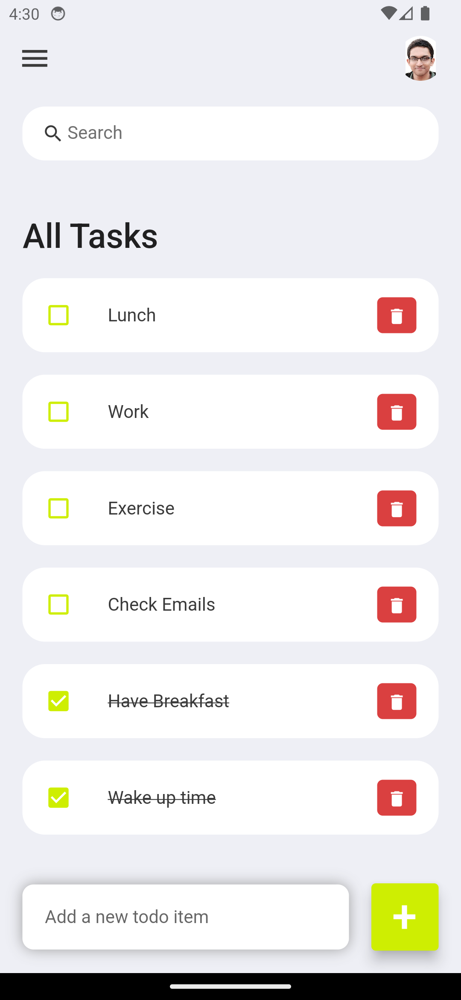

# Flutter ToDo App

A basic to-do app built with Flutter.
Allows users to add, edit, and delete tasks.
Implemented features like task priorities, due dates, and task completion status.

## Screenshot

